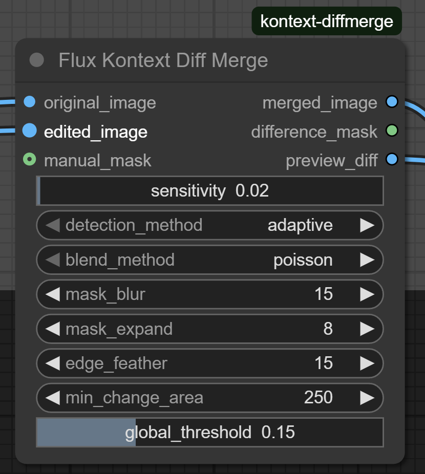

# Flux Kontext Diff Merge

A ComfyUI custom node that preserves image quality by selectively merging only the changed regions from AI-generated edits back into the original image. Perfect for use with Flux Kontext Dev to prevent quality degradation in unchanged areas.

## Features

- **Adaptive Detection**: Robust to global AI processing changes using LAB color space
- **Area Filtering**: Removes small noise areas that aren't real changes
- **Multiple Detection Methods**: Adaptive, color difference, SSIM, and combined approaches
- **Multiple Blending Methods**: Poisson, alpha, multi-band, and Gaussian blending
- **Intelligent Masking**: Automatic mask refinement with morphological operations
- **Preview Capability**: Shows detected changes with visual overlay

## Installation

### Method 1: Git Clone (Recommended)
1. `cd ComfyUI/custom_nodes/`
2. `git clone https://github.com/safzanpirani/flux-kontext-diff-merge.git`
3. Launch ComfyUI.


### Method 2: Manual Installation
1. Create folder: `ComfyUI/custom_nodes/flux-kontext-diff-merge`
2. Copy all files into this folder
3. Restart ComfyUI

## Usage

### Basic Workflow
1. **Load your original image** (before AI editing)
2. **Process with Flux Kontext Dev** to get your edited image
3. **Add the Flux Kontext Diff Merge node**
4. **Connect inputs**:
   - `original_image`: Your original unedited image
   - `edited_image`: The AI-edited output from Flux Kontext Dev
5. **Use recommended settings** (see below)

### Node Inputs



#### Required Inputs
- **`original_image`** (IMAGE): Connect from your FluxKontextImageScale node
- **`edited_image`** (IMAGE): Connect from your VAEDecode node

#### Parameters
- **`threshold`** (0.01-1.0, default: 0.02): Controls change detection threshold (increasing this reduces the size of the detected mask)
- **`detection_method`**: Choose detection approach
  - **`adaptive`**: Best for AI-processed images (recommended)
  - `color_diff`: Simple color differences
  - `ssim`: Structural similarity
  - `combined`: Multiple detection methods
- **`global_threshold`** (0.01-0.5, default: 0.15): Accounts for overall AI processing changes
- **`min_change_area`** (0-5000, default: 250): Minimum area size for valid changes
- **`blend_method`**: Choose blending technique
  - **`poisson`**: Best for seamless integration (recommended)
  - `alpha`: Simple linear blending
  - `multiband`: Multi-scale blending for complex changes
  - `gaussian`: Smooth falloff blending
- **`mask_blur`** (1-100, default: 15): Blur amount for mask edges
- **`mask_expand`** (0-50, default: 8): Pixels to expand the change mask
- **`edge_feather`** (0-50, default: 15): Additional edge softening

#### Optional
- **`manual_mask`**: Override automatic detection with your own mask

### Node Outputs
- **`merged_image`**: The final quality-preserved image
- **`difference_mask`**: The detected change mask
- **`preview_diff`**: Preview showing detected changes highlighted in red

## Optimal Settings

### Object Replacement
```
threshold: 0.02
detection_method: "adaptive"
global_threshold: 0.15
min_change_area: 250
blend_method: "poisson"
mask_blur: 15
mask_expand: 8
edge_feather: 15
```

## Results

### Example 1: Object Replacement


### Example 2: Dog to Cat Replacement


## Why Use This Node?

When Flux Kontext Dev processes an image, it introduces subtle changes throughout the entire image. This node:

- ✅ Preserves original image quality in unchanged areas
- ✅ Only applies AI changes where they're actually needed
- ✅ Handles global AI processing artifacts automatically
- ✅ Provides seamless blending between original and edited regions

## Requirements

- ComfyUI
- Python 3.8+
- OpenCV (opencv-python)
- scikit-image
- NumPy
- SciPy
- Pillow

## License

MIT License - feel free to use and modify for your projects.

## Troubleshooting

### Entire image shows red overlay
1. **Increase** `global_threshold` to 0.20+
2. **Increase** `threshold` to 0.03
3. **Use** `detection_method: "adaptive"`
4. **Increase** `min_change_area` to 500+

### No changes detected
1. **Decrease** `global_threshold` to 0.08
2. **Decrease** `threshold` to 0.01
3. **Decrease** `min_change_area` to 100
4. **Check** the `preview_diff` output for debugging 